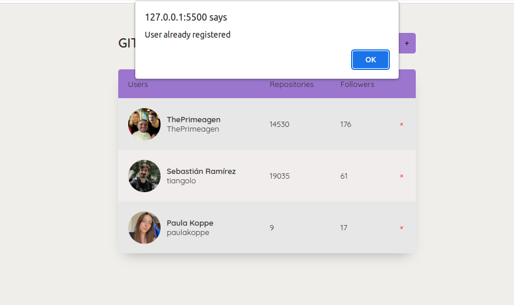
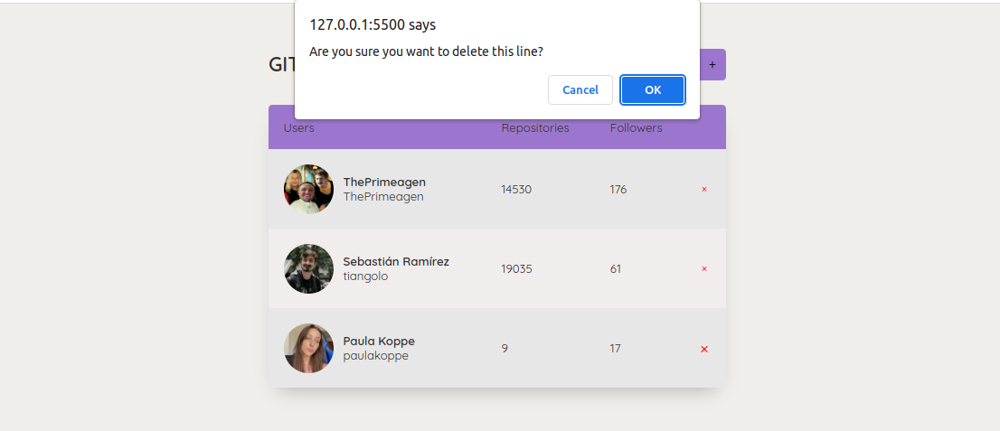

<h1 align="center"> favorites github ⭐ </h1>

## 💻 Project

This project was developed with the following technologies:

- JavaScript - mostly whit promisses  
- HTML and CSS
- Git and Github

## ✅ Preview

You can add a GitHub user in the top right field and click on the plus icon or press enter on the keyboard. 
If you click on the name, the GitHub profile will be opened in another tab.

If you try to add a user that has already been added before, an error will be displayed and it will not allow the addition.

When you click on the X icon, a confirmation for deleting the profile from your list will appear.&nbsp;

- [Access the finished project online](https://paulakoppe.github.io/gitfav/)

---
made with ♥ by paula koppe
